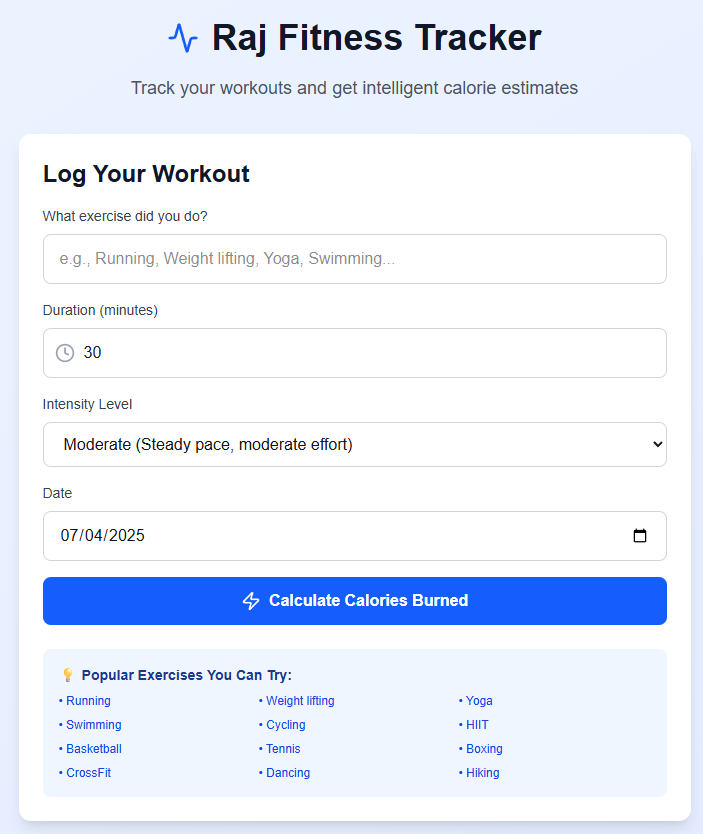
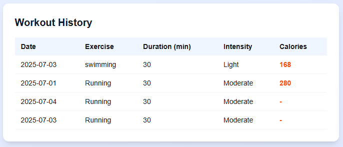

# 🚀 Raj Fitness Tracker

A modern, beautiful, and intelligent fitness tracking app built with Next.js, React, and TypeScript. Track your workouts, calories burned, and view your workout history — all in your browser, with no sign-up required!

---

## 📸 App Screenshots

### Main Workout Logging UI


### Workout History Table


---

## ✨ Features

- 🏋️‍♂️ **Log Workouts**: Track exercise, duration, intensity, and date
- 🔥 **Calorie Calculation**: Get instant, science-based calorie estimates for 40+ exercises
- 📅 **Date Picker**: Log workouts for any day, not just today
- 📊 **Workout History**: See all your past workouts in a beautiful table
- 💾 **Local Storage**: Your data stays in your browser — private and persistent
- 🌓 **Dark Mode**: Fully responsive and looks great in light or dark mode
- ⚡ **Fast & Modern UI**: Built with Next.js 15, React 19, and Tailwind CSS
- 📝 **Optional AI**: Plug in your OpenAI API key for enhanced AI calorie analysis
- 🖱️ **No Account Needed**: Just open and use!

---

## 🛠️ Tech Stack

- [Next.js 15](https://nextjs.org/) ⚡ — App Router, API Routes
- [React 19](https://react.dev/) ⚛️
- [TypeScript](https://www.typescriptlang.org/) 🟦
- [Tailwind CSS 4](https://tailwindcss.com/) 💨
- [Lucide React](https://lucide.dev/) 🖼️ — Icon set
- [OpenAI API](https://platform.openai.com/) 🤖 *(optional)*

---

## 📦 Dependencies

- `next`
- `react`
- `react-dom`
- `lucide-react`
- `openai` *(optional, for AI features)*
- `typescript`
- `tailwindcss`
- `@types/react`, `@types/react-dom`, `@types/node`
- `eslint`, `eslint-config-next`, `@eslint/eslintrc`

---

## 🧑‍💻 Setup & Installation

1. **Clone the repository**
   ```bash
   git clone https://github.com/neeraj-somani/RajFitnessTracker.git
   cd RajFitnessTracker
   ```
2. **Install dependencies**
   ```bash
   npm install
   # or
   yarn install
   ```
3. **(Optional) Enable AI features**
   - Get your OpenAI API key from [OpenAI Platform](https://platform.openai.com/api-keys)
   - Create a `.env.local` file in the root directory:
     ```env
     OPENAI_API_KEY=your_openai_api_key_here
     ```
4. **Run the development server**
   ```bash
   npm run dev
   # or
   yarn dev
   ```
5. **Open your browser**
   - Go to [http://localhost:3000](http://localhost:3000)

---

## 📝 How to Use

1. Enter your exercise (e.g., "Running", "Weight lifting", "Yoga")
2. Set the duration (in minutes)
3. Select the intensity (Light, Moderate, Vigorous, Very Vigorous)
4. Pick the date of your workout
5. Click **Calculate Calories Burned**
6. See your calories burned and a detailed explanation
7. View your workout history below the form

---

## 🗃️ How Workout History Works

- Every time you log a workout, the app saves your entry (exercise, duration, intensity, date, and calories burned) in your browser's **local storage**.
- The **Workout History Table** (see screenshot above) displays all your past workouts, including the calories burned for each entry.
- Your data is private and never leaves your device. You can close or refresh the browser and your history will remain.
- Entries with a dash (`-`) in the calories column were logged before the calories feature was added, or if there was an error calculating calories.

---

## 📄 License

This project is licensed under the [Apache-2.0 License](LICENSE).

---

## 🌟 Contributing

Pull requests and suggestions are welcome! Open an issue or submit a PR to help improve the app.

---

## 🔗 Links

- [Live Demo (if deployed)](https://github.com/neeraj-somani/RajFitnessTracker)
- [Project Repository](https://github.com/neeraj-somani/RajFitnessTracker)

---

*Made with ❤️ by Neeraj Somani*
